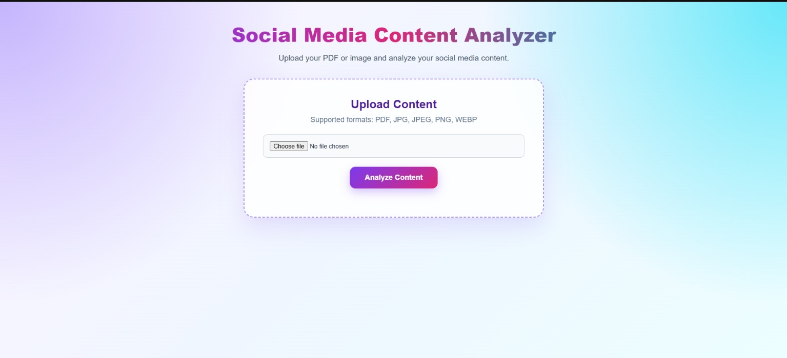
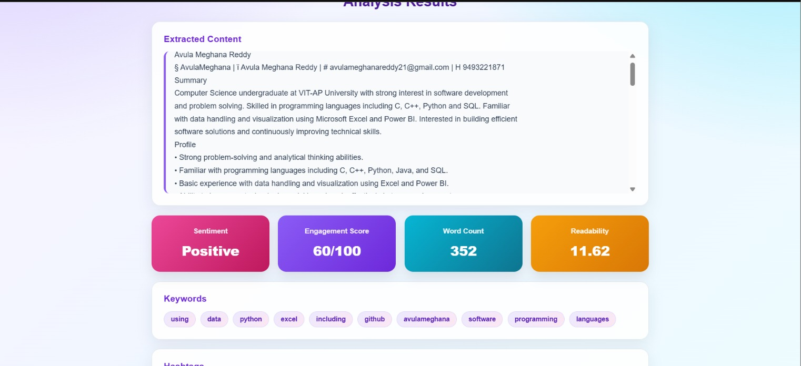
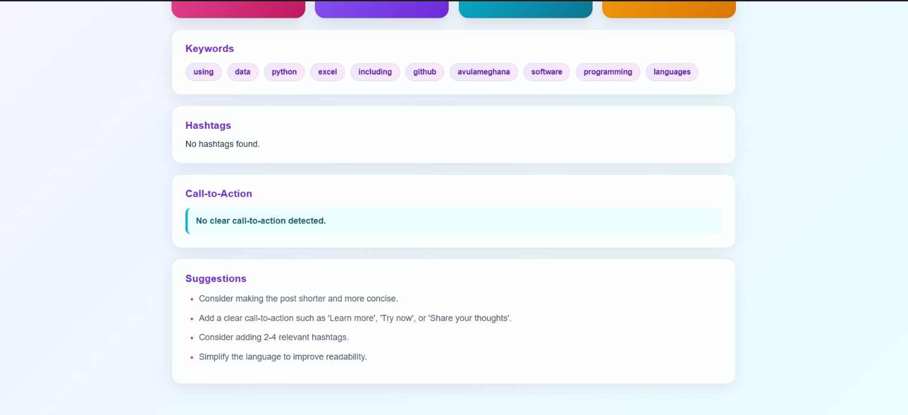

# Social Media Content Analyzer

A web-based application that extracts and analyzes text from social media content uploaded as PDF documents or images.

The application uses PDF text extraction, Optical Character Recognition (OCR), and Natural Language Processing (NLP) to provide useful insights and suggestions for improving social media content.

## Features

- Upload PDF files
- Upload JPG, JPEG, PNG, and WEBP images
- Extract text from PDF documents
- Extract text from images using OCR
- Sentiment analysis
- Word and sentence count
- Hashtag detection
- Keyword extraction
- Call-to-action detection
- Readability analysis
- Engagement score
- Content improvement suggestions

## Technology Stack

### Backend
- Python
- FastAPI
- PyMuPDF
- Tesseract OCR
- TextBlob
- textstat

### Frontend
- HTML
- CSS
- JavaScript

## Project Structure

```text
social-media-content-analyzer/
│
├── backend/
│   ├── main.py
│   └── services/
│       ├── nlp_analyzer.py
│       ├── ocr.py
│       └── pdf_extractor.py
│
├── frontend/
│   ├── index.html
│   ├── script.js
│   └── style.css
│
├── .gitignore
├── requirements.txt
└── README.md
```

## How to Run

### 1. Download the Project

Download the repository as a ZIP file from GitHub and extract it.

Open Command Prompt inside the project folder containing `requirements.txt`.

### 2. Create a Virtual Environment

```cmd
python -m venv venv
```

### 3. Activate the Virtual Environment

For Windows:

```cmd
venv\Scripts\activate
```

### 4. Install Dependencies

```cmd
pip install -r requirements.txt
```

### 5. Check Tesseract OCR

Tesseract OCR is required for image text extraction.

```cmd
tesseract --version
```

### 6. Start the Application

```cmd
uvicorn backend.main:app --reload
```

### 7. Open the Application

Open the following URL in your browser:

```text
http://127.0.0.1:8000/app/
```

## API Documentation

FastAPI interactive API documentation is available at:

```text
http://127.0.0.1:8000/docs
```

## Workflow

```text
PDF / Image Upload
        ↓
Text Extraction
        ↓
NLP Analysis
        ↓
Sentiment, Keywords, Hashtags,
Readability & Engagement Analysis
        ↓
Content Improvement Suggestions
```

## Screenshots

### Application Interface



### Content Analysis Results





## Author

Developed as a technical assignment for Unthinkable.
